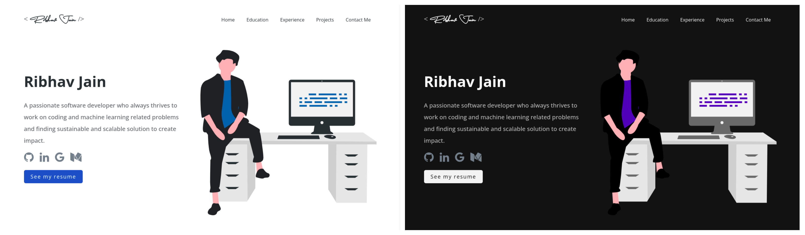

<h1 align="center"> Software Developer Portfolio </h1>

<h3 align="center"> A clean, beautiful and responsive portfolio template for Developers! <br><br>

[](https://github.com/ribhav-jain/portfolio/blob/master/LICENSE)
[](https://github.com/ribhav-jain/portfolio)
[](https://nodejs.org)
[](https://www.npmjs.com)
[](https://github.com/prettier/prettier)

</h3>

<p align="center"> 
  <a href="https://ribhav-jain.github.io/portfolio" target="_blank">
   </img>
  </a>
</p>

## Sections 📚

✔️ Summary and About me\
✔️ Skills\
✔️ Education\
✔️ Certifications\
✔️ Experience\
✔️ Projects\
✔️ Contact me

To view a live example, **[click here](https://ribhav-jain.github.io/portfolio/)**.

## How to Use 📋

- You'll need Node.js (which comes with npm) installed on your computer. While installing `nodejs`, try to install versions which are equal or greater than the versions mentioned in badges above.
- After the successful installation of `nodejs` and `npm`, clone the repository into your local system.

```bash
# Clone this repository
git clone https://github.com/ribhav-jain/portfolio.git

# Go into the repository
cd portfolio

# Install dependencies
npm install

# Start a local dev server, it will open the website locally on your browser
npm start
```

## Customize to make your own portfolio ✏️

To personalise portfolio content you need to modify: **package.json** and **Personal Information**.

#### package.json

Open this file, which is in the main cloned directory, choose any "name" and change "homepage " to `https://<github-username>.github.io/<repository-name>`. Do not forget the `https://`, otherwise fonts will not load.

#### Personal Information

You will find `src/portfolio.js` file which contains the complete information about the user. The file looks something like below:

```javascript
// Home Page
const greeting = {
    ...
}

// Social Media
const socialMediaLinks = {
    ...
}

...
```

You can change the personal information, experience, education, social media, certifications, contact information etc. in `src/portfolio.js` to directly reflect them in portfolio website.

#### Customize Lottie Animations and Illustrations 🍥

- You can choose a Lottie and download it in json format from [Lottie Files](https://lottiefiles.com/). In `src/assets/lottie`, replace the Lottie json file you want to alter. If you want to change the Lottie options, go to `src/components/displayLottie/DisplayLottie.js` and change the `defaultOptions` object.
- You can choose and download illustrations from [UnDraw](https://undraw.co/) and replace the files accordingly.

#### Other

- You need to change the website title and other descriptions in `public/index.html`
- You can define your own favicon in `public/icons` directory. If you don't have a favicon, you can generate favicons from [Favicon Generator](https://www.favicon-generator.org/) and [Favicon IO](https://favicon.io/)
- Also you can edit your website preview known as description image. Run your site locally, take a screenshot and replace with `public/icons/description.png`. Note that your screenshot should be 1280x640 for better preview

## Choose Theme 🌈

- You can take a look at `src/theme.js` file where all available themes are mentioned with their respective color codes.
- At the bottom of this file you will see the below code:
  - `export const chosenTheme = lightTheme;`
  - You need to change the name from `lightTheme` to required theme.
  - You can define new theme similarly as other themes and you can assign name of that new defined theme to `chosenTheme`.
  - Run `npm start` to check if everything is ok.

## Deployment 📦

- Once you are done with your setup and have successfully completed all steps above, you need to put your website online!
- I highly recommend using [Github Pages](https://pages.github.com/) to achieve this the easiest way.
- To deploy your website, you have two options. First you need to create a github repository with the name `<github-username>.github.io`.

**Option 1:**

- Run `npm run build` to generate the production build folder.
- Enter the build folder, `git init` and push the generated code to the `master` branch of your new repository on github. That's it. It's Done.
- You may need to `git init` and force push at every new build.

**Option 2:**

- Run `npm run deploy` to build and create a branch called `gh-pages`. It will push the `build` files to that branch.
- The last step in deploying is to enable `Github Pages` in settings of the repository.

## Technologies used 🛠️

- [React](https://reactjs.org/)
- [react-reveal](https://www.react-reveal.com/)
- [styled-components](https://styled-components.com/)

## License 📄

This project is licensed under the MIT License - see the [LICENSE.md](./LICENSE) file for details.

## Contributing 💡

If you have any suggestions on what to improve in this. Please don't hesitate to open a [pull request](https://github.com/ribhav-jain/portfolio/pulls) or [issue](https://github.com/ribhav-jain/portfolio/issues).

## References 👏🏻

Some design and implementation ideas are taken from master portfolio project.
